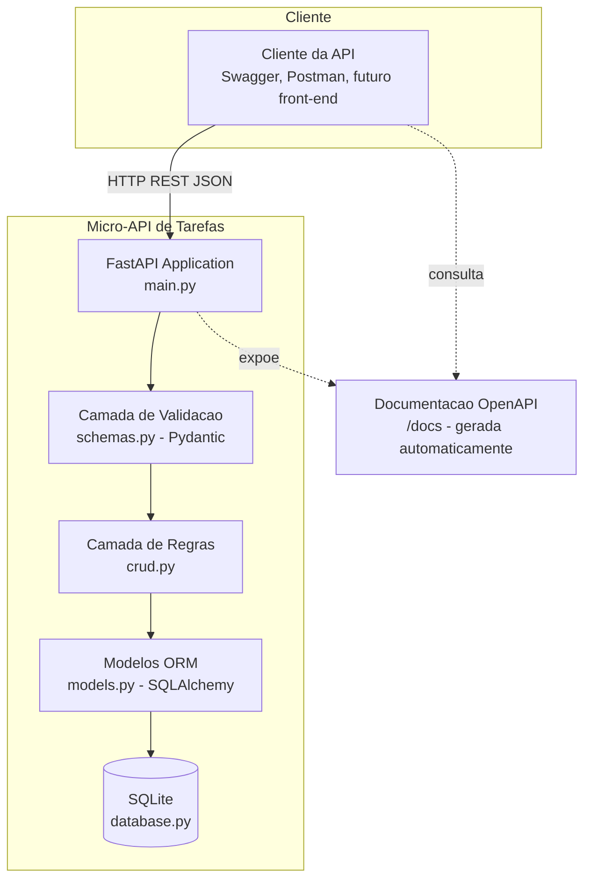
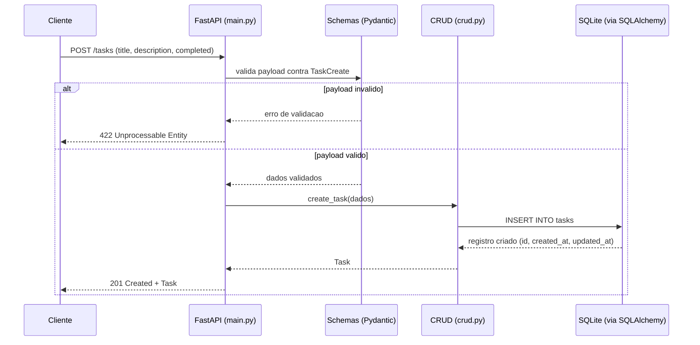

# Arquitetura — Micro-API de Tarefas

## 1. Descrição do sistema (discovery)

**Escopo:** micro-API RESTful para gerenciamento de tarefas (CRUD completo), desenvolvida como MVP acadêmico com FastAPI, SQLAlchemy e SQLite.

**Nível de visão:** sistema único e monolítico — não há decomposição em microsserviços. A visão relevante é a de *container* (aplicação + camada de persistência), não de múltiplos sistemas distribuídos.

**Limites e responsabilidades:**
- A API é responsável por expor endpoints REST, validar payloads de entrada e aplicar as operações de CRUD sobre tarefas.
- A persistência é local, em arquivo SQLite, gerenciada via SQLAlchemy.
- Está fora do escopo: autenticação/autorização, front-end, deploy em produção, filas ou processamento assíncrono.

**Integrações:**
- Nenhuma integração com sistemas externos.
- O FastAPI gera automaticamente documentação OpenAPI/Swagger (`/docs`), usada como interface de exploração e teste manual da API — não é uma integração de sistema, mas faz parte do comportamento observável.

**Restrições:**
- Execução local via `uvicorn`, sem containerização nem pipeline de deploy.
- Banco de dados SQLite em arquivo, sem suporte a concorrência real de produção.
- Projeto de uso acadêmico — sem SLA, sem requisitos de disponibilidade formais.

**Lacunas conhecidas:**
- Sem autenticação/autorização.
- Sem paginação, filtros ou ordenação na listagem de tarefas.
- Sem contrato formal de erros (códigos e formato de resposta em cada cenário de falha).
- Sem pipeline de CI/CD ou observabilidade (logs estruturados, métricas).

## 2. Diagrama estrutural (visão de containers, inspirado em C4)

> Nota: evitei ` ` dentro de blocos que o parser do Mermaid trata como nota (`note over`) e não usei caracteres Unicode de símbolo (setas especiais, emojis) — um colega da turma relatou que isso quebra o parser em certas posições.

## 3. Diagrama comportamental (sequência — jornada crítica: criar tarefa)

## 4. Decisões e ajustes a validar

Este material foi gerado a partir da estrutura pública do repositório (pastas, README, endpoints documentados), sem acesso ao código-fonte linha a linha. Antes de publicar, confirme e ajuste principalmente:

- **Nomes reais dos componentes:** os nomes dos módulos (`crud.py`, `schemas.py`, `models.py`, `database.py`) vieram da estrutura do projeto — confira se a separação de responsabilidades no diagrama estrutural bate com o código real (ex.: se `main.py` chama `schemas` antes de `crud`, ou se a validação acontece de outra forma via `Depends`).
- **Caminho de erro:** o diagrama de sequência assume validação via Pydantic com retorno 422 — verifique se há tratamento de erro adicional (ex.: exceções customizadas, try/except em `crud.py` para IDs inexistentes em GET/PUT/DELETE).
- **Endpoints não cobertos:** o diagrama de sequência cobre apenas "criar tarefa". Se quiser, posso gerar o mesmo tipo de diagrama para "buscar tarefa por ID" (fluxo de erro 404) ou "atualizar/remover", que têm um caminho de decisão diferente (existe vs. não existe).
- **O que falta para um agente implementar sem inventar:** contrato formal de erros por endpoint, exemplos de entrada/saída por caso de borda (ex.: `title` vazio, `id` inexistente), e uma decisão registrada sobre por que SQLite/SQLAlchemy em vez de outra stack — hoje isso está implícito no código, não documentado como decisão.
